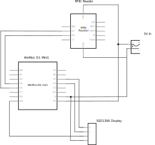

# Wiegand Display

This project is meant for demonstrating technology downgrade attacks by displaying the PACS data sent over Wiegand.  

## Requirements

### Hardware
- Arduino (Tested with Wemos D1 Mini & Arduino UNO R3) should work with others
- 0.91 Inch I2C SSD1306 OLED Display Module other sizes should work
- RFID Reader or device that generates Wiegand output

### Software
- Arduino IDE
- [WiegandNG](https://github.com/jpliew/Wiegand-NG-Multi-Bit-Wiegand-Library-for-Arduino) Library **Note:** For esp8266 platform apply the changes from [here](https://github.com/jpliew/Wiegand-NG-Multi-Bit-Wiegand-Library-for-Arduino/pull/6)
- [Adafruit SSD1306](https://github.com/adafruit/Adafruit_SSD1306) Library

## Demonstration

This shows scanning of two different credentials (35 and 26 bit formats) with a common multi-technology reader.

## Installation

### Hardware

Example schematic:

### Software

Ensure the libraries are installed, open Arduino IDE, load the `WiegandDisplay.ino`, compile, & flash.

## Acknowledgement

This project makes use of the following libraries and their examples:

[https://github.com/jpliew/Wiegand-NG-Multi-Bit-Wiegand-Library-for-Arduino](https://github.com/jpliew/Wiegand-NG-Multi-Bit-Wiegand-Library-for-Arduino)

[https://github.com/adafruit/Adafruit_SSD1306](https://github.com/adafruit/Adafruit_SSD1306)

This project was inspired by a tool shown during this fantasic talk: [Ghosting the PACS-man](https://www.youtube.com/watch?v=ghiHXK4GEzE) 

## License

This code is released under GNU GPLv3